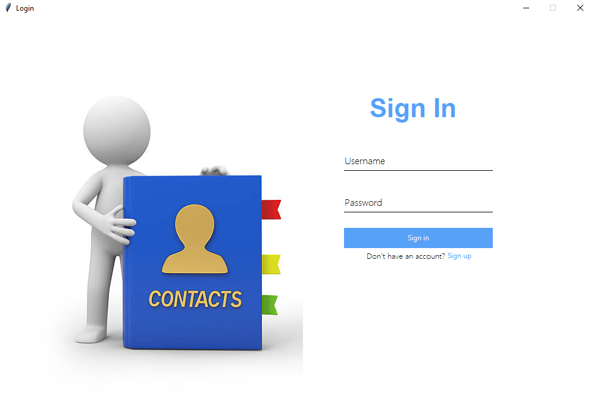
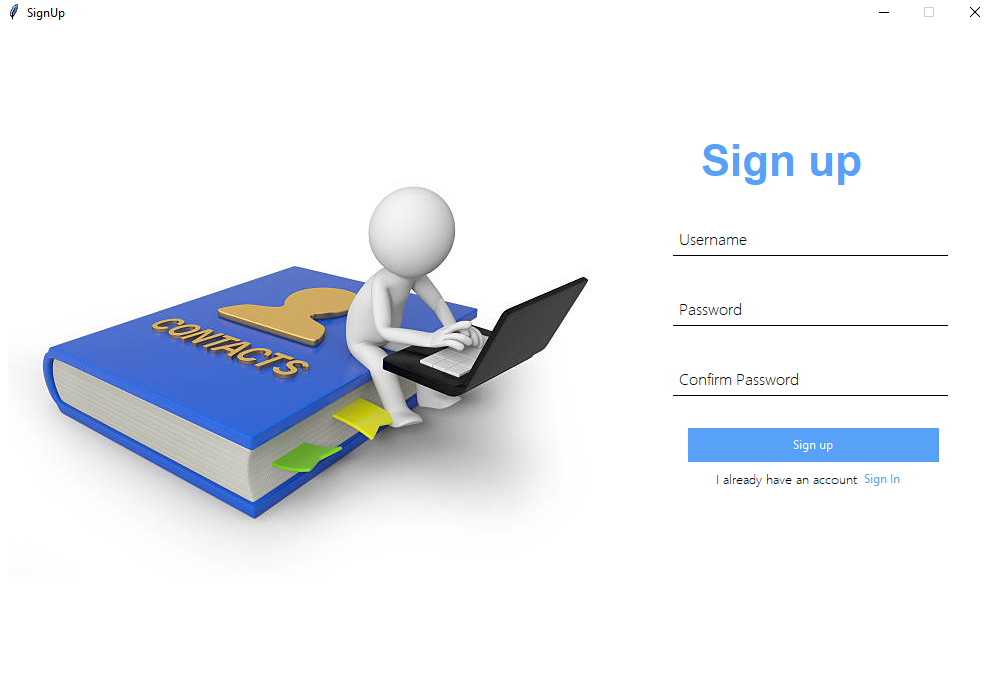
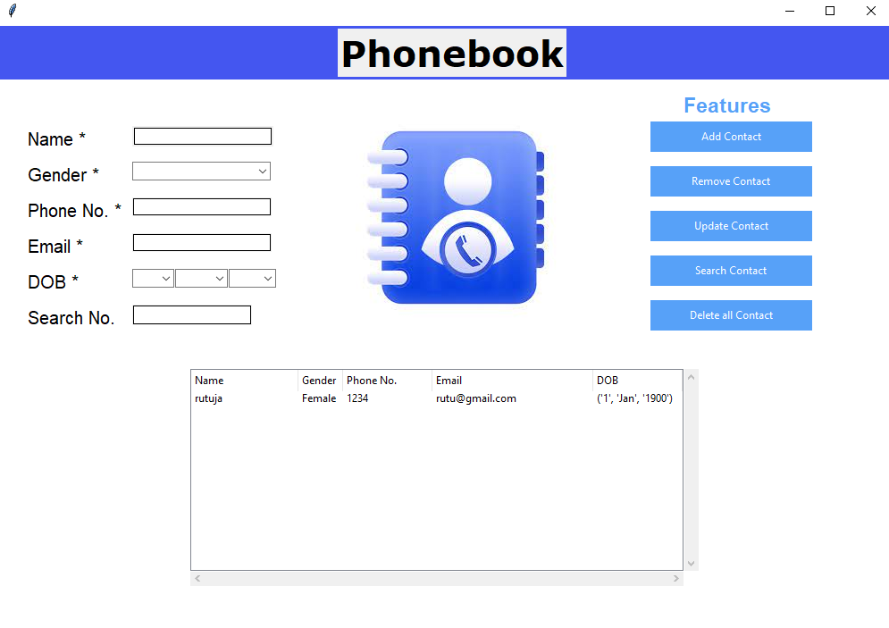

# Phone Book Application
This is a phone book application built using Python and Tkinter.

# Features
Add new contacts to the list.
Update existing contacts in the list.
Remove contacts from the list.
Remove all contacts from the list
Search for contacts by phone number.
View a list of contacts

### Dependencies

The following dependencies are required to run the application:

* Python 3.x
* Tkinter library

### Running the Application

To run the application, do the following:

1. Install the required dependencies.
2. Save the application code in a file called `phone_book.py`.
3. Open a terminal or command prompt and navigate to the directory containing the `phone_book.py` file.
4. Run the following command:

python main.py

The application window should appear.

## Screenshots

## Code Explanation

The application is built using Python and Tkinter. The login window is displayed first, allowing users to sign in or sign up. After signing in, the phone book interface is displayed, where users can view, add, update, remove, and search for contacts. The phone book data is stored in a text file named 'datasheet.txt'.

The main functions in the script are:

1. signin(): This function is called when the user clicks the "Sign In" button on the login screen. It reads the username and password from the input fields, and checks if they match any entry in the 'datasheet.txt' file. If there is a match, the phone book interface is displayed.
2. signup_command(): This function is called when the user clicks the "Sign Up" button on the login screen. It displays a sign-up window where users can enter a new username and password. The new username and password are then written to the 'datasheet.txt' file.
3. The phone book interface is created using the Tkinter library and includes functions for viewing, adding, updating, removing, and searching for contacts.

The phone book data is stored in the 'datasheet.txt' file using a dictionary, where the keys are the usernames and the values are the corresponding passwords. When the phone book interface is displayed, the script reads the 'datasheet.txt' file and creates a dictionary with the username-password pairs.

The phone book data is displayed in a table using the ttk.Treeview widget. The data is read from a CSV file named 'data.csv' using the csv module in Python. The data is displayed in columns named "Name", "Gender", "Phone No.", "Email", and "DOB". The user can add, update, remove, or search for contacts using the buttons at the bottom of the phone book interface.

The script uses various Tkinter functions to create and style the GUI components, such as Entry, Label, Frame, Button, and ttk.Treeview. It also uses the csv module to read and write the CSV file, and the ast module to parse the 'datasheet.txt' file.

Here are the steps to run the application:

Install Python on your computer if you haven't already.
Create a new Python file named 'phone_book.py' and copy the code into it.
Download the 'data.csv' and 'signup.png' files and place them in the same directory as 'phone_book.py'.
Run 'phone_book.py' by opening a terminal or command prompt and navigating to the directory containing the file. Type 'python phone_book.py' and press enter.
The login window should appear. Enter a username and password to sign in or sign up.
After signing in, the phone book interface should appear, where you can view, add, update, remove, and search for contacts.
